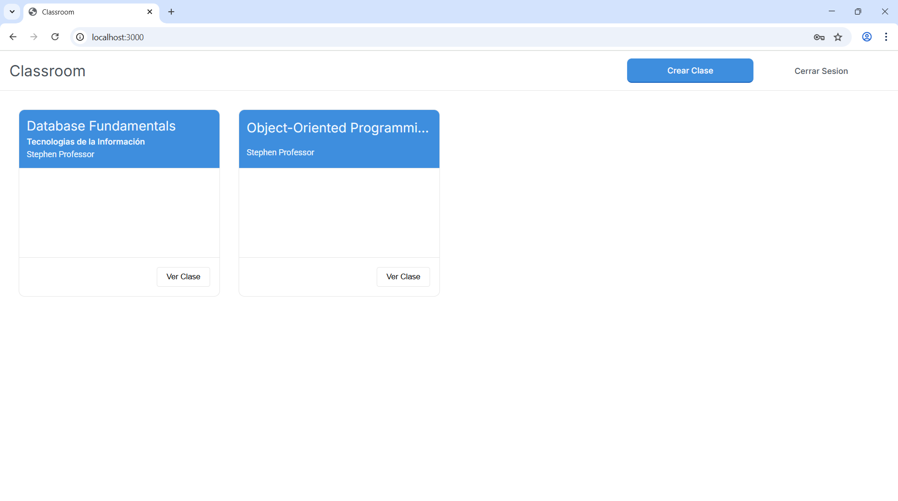
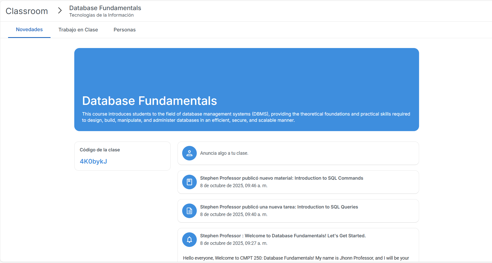
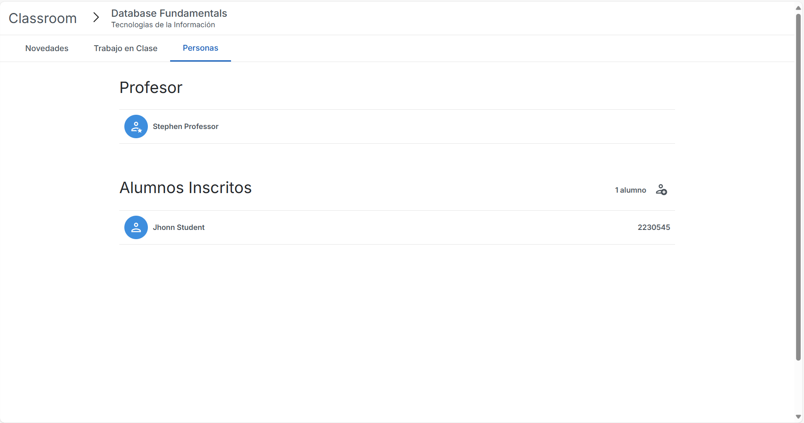
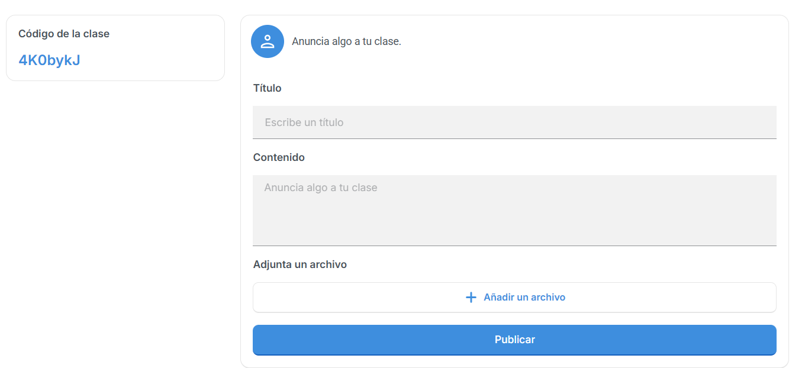
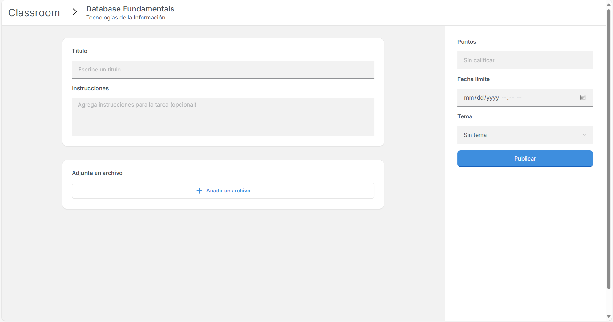
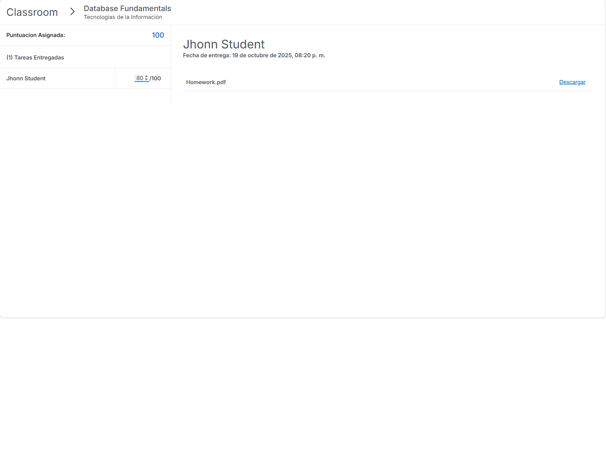

# upv-classroom

upv-classroom es un clon educativo de Google Classroom: frontend en React y backend en Node.js que soporta administración de clases, anuncios, materiales, tareas y entregas. Incluye un volcado SQL (upv_classroom.sql) con estructura y datos de ejemplo para MariaDB/MySQL.

Clon funcional de Google Classroom con pila JavaScript (React + Node.js + MariaDB), listo para demostración local con datos reales y visualizaciones.

## Disclaimer

Proyecto educativo e independiente, inspirado en Google Classroom. No está afiliado ni autorizado por Google. Todas las marcas registradas pertenecen a sus propietarios respectivos.


## Estructura del proyecto

- `back-classroom/` — Backend en Node.js
- `front-classroom/` — Frontend en React
- `upv_classroom.sql` — Volcado SQL para crear la base de datos 
## Requisitos previos

- Node.js v16+ (o superior)
- npm
- MariaDB / MySQL

## Screenshots



### Vista de clase - stream


### Vista de clase - classmates


### Vista de clase - classwork


### Crear anuncio


### Nueva tarea


### Calificar entregas


---

## 1) Clonar el repositorio

```bash
git clone https://github.com/pumpkinnlatte/upv-classroom.git
cd upv-classroom
```


## 2) Instalar dependencias

El repositorio está configurado con npm workspaces

```bash
npm install
```

Si no deseas usar workspaces, instala en cada carpeta:

Backend:
```bash
cd back-classroom
npm install
```

Frontend:
```bash
cd ../front-classroom
npm install
```

## 3) Crear / importar la base de datos

El volcado SQL `upv_classroom.sql` viene incluido en el repositorio. Verifica su ubicación (raíz o `back-classroom/`).

### Importar con cliente MySQL/MariaDB local

1. Crear la base de datos (si no existe):
```bash
mysql -u root -p -e "CREATE DATABASE IF NOT EXISTS \`upv_classroom\` CHARACTER SET utf8mb4 COLLATE utf8mb4_unicode_ci;"
```

2. Importar el volcado:
```bash 
mysql -u root -p upv_classroom < ./upv_classroom.sql
```

## 4) Configuración

> Importante: este proyecto NO usa `.env`. La configuración se lee desde `back-classroom/config.json`. Edita ese archivo para ajustar la conexión y los parámetros de encriptación/JWT.

### Ruta del archivo de configuración a editar
`back-classroom/config.json` 

### Ejemplo de `back-classroom/config.json`
```json
{
  "db": {
    "host": "localhost",
    "port": 3306,
    "user": "root",
    "password": "tu_password",
    "database": "upv_classroom"
  },
  "jwt": {
    "secret": "tu_jwt_secret",
    "refreshSecret": "tu_refresh_secret"
  },
  "bcrypt": {
    "rounds": 10
  },
  "port": 3001
}
```

- `db.database`: cambia el nombre si importaste el volcado con un nombre distinto.
- `db.user` / `db.password` / `db.host` / `db.port`: credenciales y host de tu instancia MariaDB/MySQL.
- `bcrypt.rounds`: controla la dificultad del hash.
- `jwt.secret` y `jwt.refreshSecret`: claves para firmar tokens JWT — mantenlas seguras.


## 5) Iniciar backend y frontend

El proyecto está configurado para usar npm workspaces y tiene un script en la raíz para arrancar ambos, puedes iniciar desde la raíz con el script correspondiente:
```bash
npm run start
```

De otra forma, tambien se puede desplegar desde dos terminales.

**Terminal 1 — Backend:**
```bash
cd back-classroom
npm start
```
El backend escuchará en el puerto configurado en `config.json` (ej. `3001`).

**Terminal 2 — Frontend:**
```bash
cd front-classroom
npm start
```
El frontend por defecto se despliega en `http://localhost:3000`.


---
