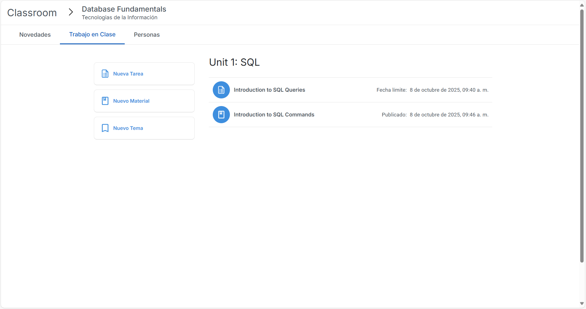

# UPV Classroom

UPV Classroom is an educational platform modeled after Google Classroom, featuring a React-based frontend and a Node.js backend. It supports class administration, announcements, course materials, assignments, and student submissions. The repository includes an SQL dump file (`upv_classroom.sql`) with the database schema and sample data compatible with MariaDB or MySQL.

## Table of Contents

- [Disclaimer](#disclaimer)
- [Project Structure](#project-structure)
- [Prerequisites](#prerequisites)
- [Screenshots](#screenshots)
- [Installation](#installation)
  - [1. Clone the Repository](#1-clone-the-repository)
  - [2. Install Dependencies](#2-install-dependencies)
  - [3. Create/Import the Database](#3-createimport-the-database)
  - [4. Configuration](#4-configuration)
  - [5. Start the Application](#5-start-the-application)
- [Usage](#usage)
- [Contributing](#contributing)
- [License](#license)

## Disclaimer

This is an independent educational project inspired by Google Classroom and is not affiliated with, endorsed by, or authorized by Google. All trademarks are the property of their respective owners.

## Project Structure

- `back-classroom/`: Contains the Node.js backend implementation.
- `front-classroom/`: Contains the React frontend application.
- `upv_classroom.sql`: SQL dump file for initializing the database schema and sample data.

## Prerequisites

- Node.js (version 16 or higher)
- npm (Node Package Manager)
- MariaDB or MySQL database server

## Screenshots

### Main Interface


### Class Views
- **Stream View**: 
- **Classmates View**: 
- **Classwork View**: 

### Content Creation and Management
- **Create Announcement**: 
- **New Assignment**: 
- **Grade Submissions**: 

## Installation

### 1. Clone the Repository

```bash
git clone https://github.com/pumpkinnlatte/upv-classroom.git
cd upv-classroom
```

### 2. Install Dependencies

The repository utilizes npm workspaces for dependency management.

```bash
npm install
```

If workspaces are not preferred, install dependencies separately:

- Backend:
  ```bash
  cd back-classroom
  npm install
  ```

- Frontend:
  ```bash
  cd ../front-classroom
  npm install
  ```

### 3. Create/Import the Database

Locate the `upv_classroom.sql` file in the repository root or backend directory.

Using a local MySQL/MariaDB client:

1. Create the database if it does not exist:
   ```bash
   mysql -u root -p -e "CREATE DATABASE IF NOT EXISTS \`upv_classroom\` CHARACTER SET utf8mb4 COLLATE utf8mb4_unicode_ci;"
   ```

2. Import the SQL dump:
   ```bash
   mysql -u root -p upv_classroom < ./upv_classroom.sql
   ```

### 4. Configuration

**Note:** This project does not use `.env` files. All settings are managed via `back-classroom/config.json`. Edit this file to configure database connections, JWT secrets, and other parameters.

Example `config.json`:
```json
{
  "db": {
    "host": "localhost",
    "port": 3306,
    "user": "root",
    "password": "your_password",
    "database": "upv_classroom"
  },
  "jwt": {
    "secret": "your_jwt_secret",
    "refreshSecret": "your_refresh_secret"
  },
  "bcrypt": {
    "rounds": 10
  },
  "port": 3001
}
```

- Adjust `db` fields to match your database credentials.
- Ensure JWT secrets are unique and secure; avoid committing them to version control in production environments.
- The `bcrypt.rounds` value determines hashing complexity; higher values increase security but may impact performance.

### 5. Start the Application

Using npm workspaces from the root directory:
```bash
npm run start
```

Alternatively, launch components separately in two terminals:

- **Backend (Terminal 1):**
  ```bash
  cd back-classroom
  npm start
  ```
  The backend will listen on the port specified in `config.json` (default: 3001).

- **Frontend (Terminal 2):**
  ```bash
  cd front-classroom
  npm start
  ```
  The frontend will be available at `http://localhost:3000` by default.

## Usage

After starting the application, access the frontend at `http://localhost:3000`. Use the provided sample data from the SQL dump to log in and explore features such as creating classes, posting announcements, assigning tasks, and grading submissions. For detailed workflows, refer to the screenshots above.

````